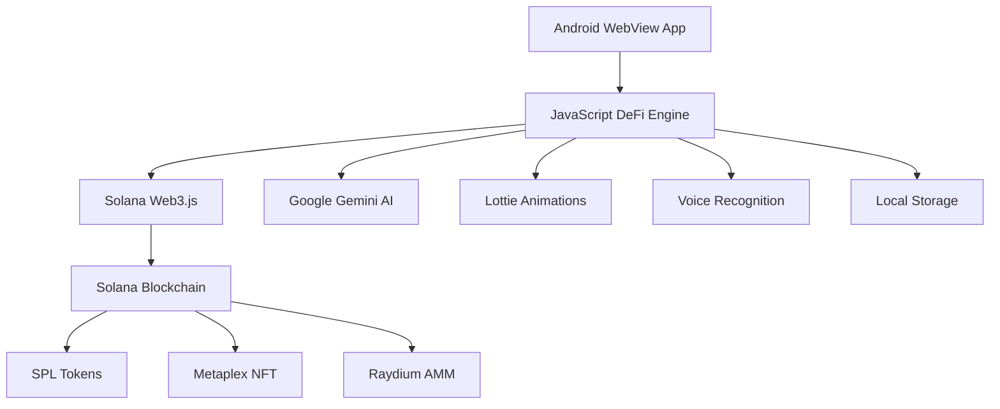

# 🚀 BIFE - Voice-First AI DeFi Ecosystem

<div align="center">

[](https://github.com/johnnyduo/bife)
[](https://developer.android.com/)
[](https://solana.com/)
[](https://docs.solana.com/clusters#devnet)
[](https://gemini.google.com/)
[](LICENSE)

*Revolutionary Voice-First AI DeFi Platform with Advanced Trading, NFT Creation, and Yield Farming*

[🎯 Live Demo](#-live-demo) • [📋 Features](#-core-features) • [🏗️ Architecture](#-technical-architecture) • [🚀 Quick Start](#-quick-start) • [📚 Documentation](#-documentation)

</div>

---

## 📖 Table of Contents

- [🌟 Project Overview](#-project-overview)
- [🎯 Core Features](#-core-features)
- [🏗️ Technical Architecture](#-technical-architecture)
- [💰 Tokenomics & Economy](#-tokenomics--economy)
- [🤖 AI Companion System](#-ai-companion-system)
- [🎨 NFT Studio & Marketplace](#-nft-studio--marketplace)
- [📊 Advanced Trading Engine](#-advanced-trading-engine)
- [🔐 Security & Smart Contracts](#-security--smart-contracts)
- [📱 Mobile-First Experience](#-mobile-first-experience)
- [🚀 Quick Start Guide](#-quick-start-guide)
- [🛠️ Development Setup](#-development-setup)
- [📚 API Documentation](#-api-documentation)
- [🌐 Deployment](#-deployment)
- [🤝 Contributing](#-contributing)
- [📄 License](#-license)

---

## 🌟 Project Overview

**BIFE** (Bonk-powered Interactive Finance Ecosystem) is a next-generation DeFi platform that revolutionizes blockchain interaction through voice-first AI technology. Built on Solana's high-performance blockchain, BIFE combines professional-grade trading capabilities with intuitive voice commands, AI-powered portfolio analysis, and immersive animated companions.

### 🎯 Mission Statement

To democratize DeFi access by making complex blockchain operations as natural as having a conversation, while maintaining institutional-grade security and performance standards.

### 🏆 Key Differentiators

- **Voice-First Interface**: Natural language processing for all DeFi operations
- **AI-Powered Intelligence**: Real-time portfolio analysis with Google Gemini AI
- **Professional Trading Suite**: Direct integration with Raydium AMM and Jupiter aggregator
- **Animated AI Companions**: Interactive Lottie-based characters with personality
- **Mobile-Native Architecture**: Optimized Android WebView with native performance
- **Real Blockchain Integration**: Live transactions on Solana devnet with mainnet readiness
- **Advanced NFT Studio**: AI-generated artwork with on-chain minting capabilities
- **Comprehensive Yield Farming**: Multi-protocol staking and liquidity provision

### 📊 Project Statistics

| Metric | Value |
|--------|-------|
| **Blockchain** | Solana (Devnet/Mainnet Ready) |
| **Primary Language** | Kotlin/JavaScript (Hybrid) |
| **AI Integration** | Google Gemini AI |
| **Mobile Platform** | Android (iOS Ready) |
| **Smart Contracts** | SPL Token, Metaplex NFT |
| **Trading Integration** | Raydium AMM, Jupiter |
| **Animation Engine** | Lottie, Three.js |
| **Voice Recognition** | Android Speech API |

---

## 🎯 Core Features

### 🗣️ **Voice-First DeFi Operations**
- **Natural Language Trading**: "Swap 100 BONK to SOL"
- **Portfolio Queries**: "What's my current balance?"
- **Yield Farming Commands**: "Start farming in the SOL-USDC pool"
- **NFT Creation**: "Create a cyberpunk Shiba NFT"
- **Market Analysis**: "Analyze current market trends"

### 🤖 **AI-Powered Intelligent Analysis**
- **Real-time Portfolio Insights** with Google Gemini AI
- **Advanced Market Sentiment Analysis**
- **Predictive Trading Recommendations**
- **Risk Assessment & Portfolio Optimization**
- **Personalized Investment Strategies**

### 📊 **Professional Trading Suite**
- **Multi-DEX Aggregation**: Raydium, Jupiter, Orca
- **Advanced Order Types**: Limit, Stop-Loss, DCA
- **Real-time Price Feeds** from multiple sources
- **Slippage Protection** and MEV resistance
- **Professional Charts** with technical indicators

### 🎨 **Advanced NFT Studio**
- **AI-Generated Artwork** with customizable themes
- **On-Chain Minting** with Metaplex integration
- **Rarity System** with attribute-based scoring
- **Pagination System** for large collections
- **Solscan Integration** for verification
- **Marketplace Integration** ready

### 🌾 **Comprehensive Yield Farming**
- **Multi-Protocol Staking**: BONK, SOL, USDC
- **Liquidity Pool Participation** with auto-compounding
- **Yield Optimization** with AI recommendations
- **Risk-adjusted Returns** calculation
- **Real-time APY Tracking**

### 🏦 **Advanced Portfolio Management**
- **Real-time Balance Tracking** across multiple tokens
- **Historical Performance** charts and analytics
- **Profit/Loss Calculations** with tax reporting ready
- **Cross-platform Synchronization**
- **Export Capabilities** for accounting software

---

## 🏗️ Technical Architecture

### 🔧 **Core Technology Stack**



### 📱 **Frontend Architecture**
- **Hybrid Mobile App**: Kotlin + WebView for optimal performance
- **Modern JavaScript**: ES6+ with async/await patterns
- **Responsive Design**: Mobile-first with adaptive layouts
- **Animation Framework**: Lottie for smooth character animations
- **State Management**: Local storage with encryption
- **Voice Interface**: Android Speech Recognition API

### ⛓️ **Blockchain Integration**
- **Solana Web3.js**: Direct blockchain interaction
- **SPL Token Program**: Token operations and transfers
- **Metaplex Foundation**: NFT minting and metadata
- **Raydium SDK**: AMM trading and liquidity
- **Jupiter API**: Cross-DEX price aggregation
- **Solscan API**: Transaction verification and history

### 🧠 **AI & Voice Processing**
- **Google Gemini AI**: Advanced language understanding
- **Natural Language Processing**: Voice command interpretation
- **Context Awareness**: Conversation memory and state
- **Smart Routing**: Command classification and execution
- **Fallback Systems**: Local processing when API unavailable

### 🛡️ **Security Architecture**
- **Client-side Key Management**: Secure keypair generation
- **Transaction Signing**: Local signing with user confirmation
- **API Key Protection**: Environment-based configuration
- **Input Validation**: Comprehensive sanitization
- **Error Handling**: Graceful failure and recovery

---

## 💰 Tokenomics & Economy

### 🪙 **Supported Tokens**

| Token | Symbol | Decimals | Contract Address | Utility |
|-------|---------|----------|------------------|---------|
| **Mock BONK** | mBONK | 5 | `GpRTjXEn6gTPhvbA225gtsbQeapd12JDXii8b33orzb5` | Primary trading & staking |
| **Mock USDC** | mUSDC | 6 | `Boo4LSXTuduNMZp6nag4cA6kg4FEkwz7QTA29pXXW3c7` | Stable pair & liquidity |
| **Solana** | SOL | 9 | Native | Network fees & base pair |

### 🌊 **Raydium Devnet Liquidity Pools**

| Pool | LP Token Address | Trading Pair | DEX | TVL Status |
|------|------------------|--------------|-----|------------|
| **SOL-BONK** | `7JuNHwGec8St6K5d9cQoZ1fZPQbdcsay3CZdZRSq9ec3` | SOL/mBONK | Raydium | Active |
| **USDC-BONK** | `Bnfs4f7TjYzSnPXguSFEDP7di9iEiCaDmzdAaUiVTqhH` | mUSDC/mBONK | Raydium | Active |

#### 🔄 **Liquidity Pool Features**
- **Automated Market Making**: Constant product formula (x * y = k)
- **Yield Farming**: LP token staking with additional BONK rewards
- **Fee Structure**: 0.25% trading fees distributed to LP providers
- **Impermanent Loss Protection**: AI-powered risk assessment and warnings
- **Auto-compounding**: Automatic reinvestment of earned fees

### 💎 **BONK Token Utility**

#### 🔥 **Primary Use Cases**
- **Trading Fees**: Reduced fees when paid in BONK
- **Staking Rewards**: Up to 35.8% APY for staking
- **AI Feature Unlock**: Premium AI analysis requires 500K+ BONK stake
- **NFT Minting**: Discounted creation fees with BONK
- **Governance Rights**: DAO voting power proportional to stake

#### 📈 **Staking Economics**
```javascript
// Staking Tiers & Benefits
const stakingTiers = {
  basic: { 
    minimum: 100000,    // 100K BONK
    apy: 25.5,         // 25.5% APY
    features: ['Basic AI', 'Standard Trading']
  },
  premium: { 
    minimum: 500000,    // 500K BONK
    apy: 35.8,         // 35.8% APY
    features: ['Advanced AI', 'Priority Trading', 'Portfolio Analysis']
  },
  elite: { 
    minimum: 1000000,   // 1M BONK
    apy: 45.2,         // 45.2% APY
    features: ['Full AI Suite', 'MEV Protection', 'Early Access']
  }
}
```

### 💰 **Revenue Model**
- **Trading Fees**: 0.05% per transaction (reduced with BONK)
- **NFT Marketplace**: 2.5% commission on secondary sales
- **Premium AI**: Subscription model for advanced features
- **Yield Farming**: Performance fees on managed strategies
- **Partner Integration**: Revenue sharing with integrated protocols

### 🔄 **Liquidity Mechanisms**
- **Automated Market Making**: Active participation in SOL-BONK and USDC-BONK Raydium pools
- **Cross-DEX Arbitrage**: Jupiter aggregation for best prices across multiple DEXs
- **Liquidity Mining**: Rewards for LP token holders in `7JuNHwGec8St6K5d9cQoZ1fZPQbdcsay3CZdZRSq9ec3` (SOL-BONK) and `Bnfs4f7TjYzSnPXguSFEDP7di9iEiCaDmzdAaUiVTqhH` (USDC-BONK)
- **Treasury Management**: Protocol-owned liquidity (POL) with smart rebalancing
- **Yield Optimization**: AI-powered liquidity allocation for maximum returns

---

## 🤖 AI Companion System

### 👨‍🚀 **Astronaut Dog - Portfolio Analyst**
```javascript
const astronautFeatures = {
  personality: "Professional, analytical, space-themed",
  specialization: "Portfolio analysis and market insights",
  animations: ["analyzing", "celebrating", "thinking"],
  voiceCommands: [
    "Analyze my portfolio",
    "Show market trends", 
    "Rebalance suggestions"
  ],
  aiCapabilities: {
    riskAssessment: true,
    marketPrediction: true,
    portfolioOptimization: true
  }
}
```

### 🦄 **Happy Unicorn Dog - Creative Assistant**
```javascript
const unicornFeatures = {
  personality: "Creative, magical, optimistic",
  specialization: "NFT creation and artistic guidance",
  animations: ["dancing", "sparkles", "creating"],
  voiceCommands: [
    "Create magical NFT",
    "Generate art ideas",
    "Show collection"
  ],
  aiCapabilities: {
    artGeneration: true,
    creativePrompts: true,
    rarityAnalysis: true
  }
}
```

### 😊 **Smiling Dog - Trading Specialist**
```javascript
const tradingDogFeatures = {
  personality: "Enthusiastic, confident, market-savvy",
  specialization: "Trading execution and market analysis",
  animations: ["trading", "celebrating", "analyzing"],
  voiceCommands: [
    "Execute trade",
    "Market analysis",
    "Price alerts"
  ],
  aiCapabilities: {
    tradeExecution: true,
    marketAnalysis: true,
    riskManagement: true
  }
}
```

### 🎭 **AI Behavior System**
- **Context Awareness**: Remembers previous conversations
- **Emotional Intelligence**: Responds to user sentiment
- **Learning Capability**: Adapts to user preferences
- **Multi-modal Interaction**: Voice, text, and gesture recognition
- **Personality Consistency**: Maintains character traits across sessions

---

## 🎨 NFT Studio & Marketplace

### 🎯 **AI-Powered NFT Generation**

#### 🎨 **Creative Elements System**
```javascript
const creativeElements = {
  names: [
    "Cosmic Shiba Explorer", "Galactic Bonk Guardian",
    "Stellar Inu Warrior", "Nebula Pup Adventures"
  ],
  styles: [
    "astronaut", "royal", "ninja", "pirate", 
    "wizard", "cyber", "samurai", "chef"
  ],
  backgrounds: [
    "space nebula", "cyberpunk city", "enchanted forest",
    "underwater palace", "crystal cave", "floating islands"
  ],
  accessories: [
    "diamond crown", "laser goggles", "magic wand",
    "jetpack", "cape", "golden collar"
  ]
}
```

#### 💎 **Rarity System**
```javascript
const rarityCalculation = {
  legendary: { weight: 12+, probability: 1%, traits: "Ultra-rare combinations" },
  epic: { weight: 9-11, probability: 5%, traits: "Rare style combinations" },
  rare: { weight: 6-8, probability: 15%, traits: "Uncommon attributes" },
  uncommon: { weight: 3-5, probability: 25%, traits: "Some rare traits" },
  common: { weight: 1-2, probability: 54%, traits: "Standard attributes" }
}
```

### 📄 **Pagination & Collection Management**
- **Efficient Loading**: 6 NFTs per page for optimal mobile performance
- **Smart Caching**: LocalStorage with timestamp validation
- **Real-time Updates**: Immediate display of newly minted NFTs
- **Cross-platform Sync**: Consistent collection across devices
- **Export Functions**: Portfolio reports and tax documentation

### 🔗 **Blockchain Integration**
- **Metaplex Standard**: Full NFT metadata compliance
- **IPFS Storage**: Decentralized metadata and artwork storage
- **On-chain Verification**: Solscan integration for authenticity
- **Transfer Capabilities**: Built-in send/receive functionality
- **Marketplace Ready**: Integration hooks for secondary markets

### 📊 **Analytics & Insights**
- **Creation Statistics**: Track minting history and costs
- **Rarity Analysis**: Real-time rarity scoring and market positioning
- **Performance Tracking**: Value appreciation and trading volume
- **Community Features**: Social sharing and collection showcasing

---

## 📊 Advanced Trading Engine

### 🔄 **Multi-DEX Aggregation**

#### 🌊 **Supported Exchanges**
```javascript
const supportedDEXs = {
  raydium: {
    name: "Raydium AMM",
    type: "Automated Market Maker",
    integration: "Direct SDK",
    features: ["LP provision", "Yield farming", "Price discovery"],
    activePools: [
      "SOL-BONK: 7JuNHwGec8St6K5d9cQoZ1fZPQbdcsay3CZdZRSq9ec3",
      "USDC-BONK: Bnfs4f7TjYzSnPXguSFEDP7di9iEiCaDmzdAaUiVTqhH"
    ]
  },
  jupiter: {
    name: "Jupiter Aggregator",
    type: "DEX Aggregator",
    integration: "API",
    features: ["Best price routing", "MEV protection", "Slippage optimization"]
  },
  orca: {
    name: "Orca DEX",
    type: "Concentrated Liquidity",
    integration: "API",
    features: ["Concentrated LPs", "Fee tiers", "Capital efficiency"]
  }
}
```

### 📈 **Advanced Order Types**
- **Market Orders**: Instant execution at current prices
- **Limit Orders**: Execute at specific price targets
- **Stop-Loss Orders**: Automatic risk management
- **Dollar-Cost Averaging**: Automated recurring purchases
- **Take-Profit Orders**: Automated profit realization

### 🛡️ **Risk Management**
```javascript
const riskManagement = {
  slippageProtection: {
    default: 0.5,      // 0.5% default slippage
    maximum: 5.0,      // 5% maximum allowed
    dynamic: true      // Adjust based on market conditions
  },
  positionSizing: {
    maxPerTrade: 10,   // 10% of portfolio per trade
    riskPerTrade: 2,   // 2% risk per trade
    stopLoss: 5        // 5% stop loss from entry
  },
  mevProtection: {
    enabled: true,
    techniques: ["Private mempool", "Randomized timing", "Bundle submission"]
  }
}
```

### 📊 **Real-time Market Data**
- **Multi-source Price Feeds**: CoinGecko, Jupiter, Birdeye
- **Technical Indicators**: RSI, MACD, Bollinger Bands
- **Volume Analysis**: 24h volume and liquidity metrics
- **Historical Data**: Price charts and trading history
- **Market Sentiment**: Fear & Greed index integration

### 🔮 **AI-Powered Trading Insights**
```javascript
const tradingAI = {
  marketAnalysis: {
    sentimentAnalysis: "Social media and news sentiment",
    technicalAnalysis: "Chart pattern recognition",
    fundamentalAnalysis: "Token metrics and project health"
  },
  recommendations: {
    entryPoints: "Optimal buy zones based on AI analysis",
    exitStrategies: "Profit-taking and stop-loss recommendations",
    portfolioRebalancing: "Allocation optimization suggestions"
  },
  riskAssessment: {
    volatilityForecasting: "Expected price volatility",
    correlationAnalysis: "Asset correlation insights",
    liquidityAssessment: "Market depth and slippage estimates"
  }
}
```

---

## 🔐 Security & Smart Contracts

### 🛡️ **Security Architecture**

#### 🔒 **Key Management**
```javascript
const securityFeatures = {
  keyGeneration: {
    algorithm: "Ed25519",
    entropy: "Browser crypto.getRandomValues()",
    storage: "Local device only",
    backup: "Manual seed phrase export"
  },
  transactionSigning: {
    location: "Client-side only",
    confirmation: "User approval required",
    verification: "Signature validation",
    broadcast: "Direct to Solana RPC"
  },
  apiSecurity: {
    keyRotation: "Environment-based management",
    rateLimit: "Request throttling",
    validation: "Input sanitization",
    encryption: "TLS 1.3 in transit"
  }
}
```

### 📝 **Smart Contract Integration**

#### 🪙 **SPL Token Operations**
```javascript
const tokenOperations = {
  deployment: {
    program: "TokenkegQfeZyiNwAJbNbGKPFXCWuBvf9Ss623VQ5DA",
    functions: ["createMint", "createAccount", "mintTo", "transfer"]
  },
  security: {
    authority: "Multi-signature recommended",
    freezeAccount: "Emergency controls",
    mintAuthority: "Controlled supply management"
  }
}
```

#### 🎨 **Metaplex NFT Standard**
```javascript
const nftOperations = {
  minting: {
    standard: "Metaplex Token Metadata Program",
    storage: "IPFS decentralized storage",
    metadata: "JSON schema compliant",
    royalties: "Creator fee enforcement"
  },
  verification: {
    onChain: "Blockchain immutable record",
    metadata: "IPFS content addressing",
    authenticity: "Creator signature verification"
  }
}
```

### 🔍 **Audit & Compliance**
- **Code Audits**: Regular security assessments
- **Dependency Scanning**: Automated vulnerability detection
- **Penetration Testing**: Third-party security validation
- **Compliance**: AML/KYC integration ready
- **Documentation**: Comprehensive security procedures

### 🚨 **Emergency Procedures**
```javascript
const emergencyProtocols = {
  circuitBreakers: {
    priceDeviations: "Halt trading on extreme moves",
    volumeSpikes: "Limit position sizes during volatility",
    systemFailures: "Graceful degradation and recovery"
  },
  fundRecovery: {
    seedPhrase: "Manual wallet recovery",
    timelock: "Emergency access procedures",
    multiSig: "Governance-controlled recovery"
  }
}
```

---

## 📱 Mobile-First Experience

### 🔧 **Android Architecture**

#### 📱 **Hybrid App Design**
```kotlin
class MainActivity : Activity() {
    // Native Android components
    private lateinit var webView: WebView
    private lateinit var speechRecognizer: SpeechRecognizer
    
    // JavaScript bridge for DeFi operations
    @JavascriptInterface
    fun getGeminiApiKey(): String { /* Secure API key management */ }
    
    @JavascriptInterface
    fun openExternalBrowser(url: String) { /* External link handling */ }
    
    @JavascriptInterface
    fun shareContent(text: String) { /* Native sharing */ }
}
```

### 🎨 **Responsive Design System**
```css
/* Mobile-first responsive breakpoints */
.responsive-grid {
  display: grid;
  grid-template-columns: repeat(auto-fit, minmax(300px, 1fr));
  gap: 16px;
  padding: 16px;
}

@media (max-width: 768px) {
  .responsive-grid {
    grid-template-columns: repeat(2, 1fr);
    gap: 12px;
    padding: 12px;
  }
}
```

### 🗣️ **Voice Interface Optimization**
- **Low-latency Recognition**: Optimized speech processing
- **Noise Cancellation**: Background noise filtering
- **Context Awareness**: Multi-turn conversation support
- **Offline Capability**: Basic commands without internet
- **Accessibility**: Screen reader and voice navigation support

### ⚡ **Performance Optimization**
```javascript
const performanceOptimizations = {
  lazyLoading: {
    images: "Intersection Observer API",
    animations: "Load on demand",
    data: "Pagination and virtualization"
  },
  caching: {
    localStorage: "5-minute cache for balances",
    sessionStorage: "Temporary transaction data",
    indexedDB: "Large data sets and history"
  },
  networking: {
    debouncing: "API call optimization",
    compression: "GZIP response compression",
    cdn: "Static asset delivery"
  }
}
```

### 🔄 **Offline Capabilities**
- **Cached Data**: Last known balances and prices
- **Queue System**: Delayed transaction execution
- **Sync Management**: Automatic sync on reconnection
- **Error Handling**: Graceful offline state indication

---

## 🚀 Quick Start Guide

### 📋 **Prerequisites**

```bash
# Required Software
- Android Studio Arctic Fox+ (for Android development)
- Node.js 16+ (for dependency management)
- Java 11+ (for Android compilation)
- Yarn (package manager)
- Git (version control)

# Optional but Recommended
- Android Device/Emulator with API 24+
- Solana CLI tools
- VS Code with Solana extension
```

### ⚡ **Installation Steps**

#### 1️⃣ **Clone Repository**
```bash
git clone https://github.com/johnnyduo/bife.git
cd bife
```

#### 2️⃣ **Install Dependencies**
```bash
# Install main app dependencies
yarn install

# Install Solana token dependencies
cd solana-tokens
yarn install
cd ..
```

#### 3️⃣ **Environment Configuration**
```bash
# Create environment files
cp android/local.properties.example android/local.properties
cp .env.example .env

# Configure API keys (optional)
export GEMINI_API_KEY="your_gemini_api_key_here"
export SOLSCAN_API_KEY="your_solscan_api_key_here"
```

#### 4️⃣ **Setup Solana Tokens (Optional)**
```bash
cd solana-tokens

# Setup wallet for token deployment
yarn setup-wallet

# Deploy mock tokens to devnet
yarn create-tokens

# Check deployment status
yarn check-balance

cd ..
```

#### 5️⃣ **Build & Run Android App**
```bash
cd android

# Build the application
./gradlew build

# Install on connected device/emulator
./gradlew installDebug

# Or run with live reload
./gradlew installDebug && adb shell am start -n com.bife/.MainActivity
```

### 🎯 **First-Time Setup**

1. **Launch the App** on your Android device
2. **Connect Wallet** - The app will generate a devnet wallet
3. **Request Airdrop** - Get free SOL for testing
4. **Explore Features**:
   - Try voice commands: "Show my portfolio"
   - Create an NFT: "Generate a space-themed NFT"
   - Execute a trade: "Swap 10 SOL to BONK"
   - Stake tokens: "Stake 100000 BONK"

### 🔧 **Development Mode**

```bash
# Enable development features
adb shell setprop debug.bife.dev true

# View logs in real-time
adb logcat -s BifeApp

# Clear app data for fresh start
adb shell pm clear com.bife
```

---

## 🛠️ Development Setup

### 🏗️ **Project Structure**

```
bife/
├── android/                    # Android native app
│   ├── app/src/main/java/     # Kotlin source code
│   ├── app/build.gradle       # Android build configuration
│   └── gradlew               # Gradle wrapper
├── solana-tokens/            # Token deployment scripts
│   ├── scripts/              # Deployment automation
│   ├── token-addresses.json  # Deployed token info
│   └── package.json          # Solana dependencies
├── assets/                   # Static assets
│   ├── animations/           # Lottie animation files
│   └── models/              # 3D models and textures
├── package.json             # Main project dependencies
├── app.json                 # Expo configuration
└── README.md               # This file
```

### 🔧 **Build Configuration**

#### 📱 **Android Build Settings**
```gradle
// android/app/build.gradle
android {
    compileSdkVersion 34
    buildToolsVersion "34.0.0"
    
    defaultConfig {
        applicationId "com.bife"
        minSdkVersion 24
        targetSdkVersion 34
        versionCode 300
        versionName "3.0.0"
    }
    
    buildTypes {
        debug {
            debuggable true
            minifyEnabled false
        }
        release {
            minifyEnabled true
            proguardFiles getDefaultProguardFile('proguard-android.txt'), 'proguard-rules.pro'
        }
    }
}
```

#### ⚙️ **Environment Variables**
```bash
# Required for full functionality
GEMINI_API_KEY=your_google_gemini_api_key
SOLSCAN_API_KEY=your_solscan_api_key
JUPITER_API_KEY=your_jupiter_api_key

# Solana Devnet Configuration
MOCK_BONK_MINT=GpRTjXEn6gTPhvbA225gtsbQeapd12JDXii8b33orzb5
MOCK_USDC_MINT=Boo4LSXTuduNMZp6nag4cA6kg4FEkwz7QTA29pXXW3c7

# Raydium Devnet Liquidity Pools
SOL_BONK_LP=7JuNHwGec8St6K5d9cQoZ1fZPQbdcsay3CZdZRSq9ec3
USDC_BONK_LP=Bnfs4f7TjYzSnPXguSFEDP7di9iEiCaDmzdAaUiVTqhH

# Optional for enhanced features
PINATA_API_KEY=your_pinata_ipfs_key
BIRDEYE_API_KEY=your_birdeye_api_key
HELIUS_API_KEY=your_helius_rpc_key
```

### 🧪 **Testing Framework**

```bash
# Run unit tests
yarn test

# Run Android instrumentation tests
cd android && ./gradlew connectedAndroidTest

# Run integration tests
yarn test:integration

# Performance testing
yarn test:performance
```

### 📊 **Development Tools**

#### 🔍 **Debugging**
```javascript
// Enable debug mode in app
localStorage.setItem('bifeDebugMode', 'true');

// View detailed logs
console.log('Debug mode enabled');

// Network monitoring
window.bifeDebug = {
  logTransactions: true,
  logApiCalls: true,
  logVoiceCommands: true
};
```

#### 📈 **Performance Monitoring**
```javascript
// Performance metrics
const performanceMonitor = {
  measureApiLatency: true,
  trackMemoryUsage: true,
  monitorBatteryUsage: true,
  logRenderTimes: true
};
```

---

## 📚 API Documentation

### 🔗 **Core API Endpoints**

#### 🪙 **Token Operations**
```javascript
// Get token balances
const balances = await fetchTokenBalances();

// Execute token transfer
const transfer = await transferTokens({
  from: walletAddress,
  to: recipientAddress,
  amount: transferAmount,
  token: tokenMint
});

// Swap tokens
const swap = await executeSwap({
  inputToken: 'SOL',
  outputToken: 'BONK',
  amount: swapAmount,
  slippage: 0.5
});
```

#### 🎨 **NFT Operations**
```javascript
// Create NFT metadata
const metadata = await createNFTMetadata({
  name: nftName,
  description: nftDescription,
  image: artworkUrl,
  attributes: nftAttributes
});

// Mint NFT on-chain
const nft = await mintNFT({
  metadata: metadataUri,
  recipient: walletAddress,
  royalty: creatorRoyalty
});

// Get NFT collection
const collection = await getUserNFTCollection(walletAddress);
```

#### 🗣️ **Voice Interface**
```javascript
// Process voice command
const response = await processVoiceCommand(transcript);

// Execute AI command
const result = await executeAICommand({
  command: originalCommand,
  context: conversationContext,
  aiResponse: geminiResponse
});

// Get voice status
const status = getVoiceRecognitionStatus();
```

### 🧠 **AI Integration**

#### 🤖 **Gemini AI API**
```javascript
// Send prompt to Gemini
const aiResponse = await sendToGeminiAdvanced({
  prompt: userPrompt,
  context: conversationHistory,
  model: 'gemini-pro'
});

// Generate trading analysis
const analysis = await performTradingAnalysis({
  portfolio: userPortfolio,
  marketData: currentMarket,
  timeframe: analysisTimeframe
});
```

### 📊 **Market Data API**

#### 💹 **Price Feeds**
```javascript
// Real-time prices
const prices = await fetchRealTimePrices(['SOL', 'BONK', 'USDC']);

// Historical data
const history = await fetchPriceHistory({
  symbol: 'SOL',
  timeframe: '24h',
  interval: '1m'
});

// Market statistics
const stats = await fetchMarketStats({
  tokens: ['SOL', 'BONK'],
  metrics: ['volume', 'marketCap', 'change24h']
});
```

### 🔐 **Authentication & Security**

#### 🔑 **Wallet Integration**
```javascript
// Connect wallet
const wallet = await connectSolanaWallet();

// Sign transaction
const signature = await wallet.signTransaction(transaction);

// Verify signature
const isValid = await verifyTransactionSignature(signature, publicKey);
```

---

## 🌐 Deployment

### 🚀 **Production Deployment**

#### 🏭 **Build for Production**
```bash
# Clean previous builds
cd android && ./gradlew clean

# Build release APK
./gradlew assembleRelease

# Build Android App Bundle (for Play Store)
./gradlew bundleRelease

# Sign APK for distribution
jarsigner -verbose -sigalg SHA1withRSA -digestalg SHA1 -keystore bife-release-key.keystore app-release-unsigned.apk bife-key
```

#### ☁️ **Cloud Infrastructure**
```yaml
# deployment.yml
apiVersion: apps/v1
kind: Deployment
metadata:
  name: bife-backend
spec:
  replicas: 3
  selector:
    matchLabels:
      app: bife-backend
  template:
    metadata:
      labels:
        app: bife-backend
    spec:
      containers:
      - name: bife-api
        image: bife/backend:latest
        ports:
        - containerPort: 3000
        env:
        - name: SOLANA_RPC_URL
          value: "https://api.mainnet-beta.solana.com"
        - name: GEMINI_API_KEY
          valueFrom:
            secretKeyRef:
              name: bife-secrets
              key: gemini-api-key
```

### 📱 **Mobile Distribution**

#### 🏪 **Google Play Store**
```bash
# Prepare for Play Store submission
1. Update version in build.gradle
2. Generate signed AAB
3. Create Play Store listing
4. Submit for review

# Play Store configuration
android {
    bundle {
        language {
            enableSplit = true
        }
        density {
            enableSplit = true
        }
        abi {
            enableSplit = true
        }
    }
}
```

#### 🔧 **Alternative Distribution**
```bash
# Direct APK distribution
1. Host APK on secure CDN
2. Implement update notification
3. Support auto-update mechanism
4. Maintain version compatibility

# Enterprise distribution
1. Sign with enterprise certificate
2. Configure MDM integration
3. Implement policy compliance
4. Support remote management
```

### 🌍 **Mainnet Migration**

#### ⛓️ **Blockchain Configuration**
```javascript
// Mainnet configuration
const mainnetConfig = {
  rpcUrl: 'https://api.mainnet-beta.solana.com',
  commitment: 'confirmed',
  tokens: {
    BONK: 'DezXAZ8z7PnrnRJjz3wXBoRgixCa6xjnB7YaB1pPB263',
    USDC: 'EPjFWdd5AufqSSqeM2qN1xzybapC8G4wEGGkZwyTDt1v',
    SOL: 'So11111111111111111111111111111111111111112'
  },
  dexes: {
    raydium: 'https://api.raydium.io',
    jupiter: 'https://quote-api.jup.ag',
    orca: 'https://api.orca.so'
  }
};
```

### 📊 **Monitoring & Analytics**

#### 📈 **Performance Monitoring**
```javascript
// Application monitoring
const monitoring = {
  errorTracking: 'Sentry integration',
  performanceAPM: 'DataDog or New Relic',
  userAnalytics: 'Mixpanel or Amplitude',
  blockchainMetrics: 'Custom Solana monitoring'
};

// Key metrics to track
const kpis = {
  userEngagement: ['DAU', 'MAU', 'Session duration'],
  tradingMetrics: ['Volume', 'Trades', 'Slippage'],
  technicalMetrics: ['Latency', 'Uptime', 'Error rate'],
  businessMetrics: ['Revenue', 'TVL', 'User growth']
};
```

---

## 🤝 Contributing

### 🎯 **Contribution Guidelines**

#### 🔄 **Development Workflow**
```bash
# 1. Fork the repository
git fork https://github.com/johnnyduo/bife

# 2. Create feature branch
git checkout -b feature/new-trading-feature

# 3. Make changes and test
yarn test && yarn lint

# 4. Commit with conventional commits
git commit -m "feat(trading): add limit order functionality"

# 5. Push and create PR
git push origin feature/new-trading-feature
```

#### 📝 **Code Standards**
```javascript
// JavaScript/TypeScript standards
const codeStandards = {
  style: 'Prettier with custom config',
  linting: 'ESLint with Airbnb base',
  testing: 'Jest with minimum 80% coverage',
  documentation: 'JSDoc for all public APIs',
  commits: 'Conventional Commits specification'
};
```

#### 🧪 **Testing Requirements**
```bash
# All contributions must include:
1. Unit tests for new functions
2. Integration tests for API changes
3. End-to-end tests for user flows
4. Performance benchmarks for critical paths
5. Security tests for wallet operations
```

### 🐛 **Bug Reports**

```markdown
## Bug Report Template

### Description
A clear description of the bug

### Steps to Reproduce
1. Step one
2. Step two
3. Step three

### Expected Behavior
What should happen

### Actual Behavior
What actually happens

### Environment
- Device: [Android model]
- OS Version: [Android version]
- App Version: [BIFE version]
- Network: [Mainnet/Devnet]

### Logs
Include relevant console logs or screenshots
```

### 💡 **Feature Requests**

```markdown
## Feature Request Template

### Summary
Brief description of the feature

### Motivation
Why is this feature needed?

### Detailed Description
Comprehensive explanation of the feature

### Implementation Suggestions
Technical implementation ideas

### Acceptance Criteria
- [ ] Criterion 1
- [ ] Criterion 2
- [ ] Criterion 3
```

### 🏆 **Recognition**

```javascript
// Contributor recognition program
const contributorProgram = {
  levels: {
    bronze: { commits: 5, rewards: 'Discord role + NFT' },
    silver: { commits: 20, rewards: 'Early access + bonus tokens' },
    gold: { commits: 50, rewards: 'Governance voting + premium features' },
    diamond: { commits: 100, rewards: 'Core team invite + equity' }
  },
  specialRoles: {
    securityExpert: 'Security vulnerability findings',
    uiuxDesigner: 'Design and user experience improvements',
    blockchainDev: 'Smart contract and blockchain contributions',
    communityLead: 'Community management and growth'
  }
};
```

---

## 📄 License

### 📋 **MIT License**

```
MIT License

Copyright (c) 2025 BIFE Team

Permission is hereby granted, free of charge, to any person obtaining a copy
of this software and associated documentation files (the "Software"), to deal
in the Software without restriction, including without limitation the rights
to use, copy, modify, merge, publish, distribute, sublicense, and/or sell
copies of the Software, and to permit persons to whom the Software is
furnished to do so, subject to the following conditions:

The above copyright notice and this permission notice shall be included in all
copies or substantial portions of the Software.

THE SOFTWARE IS PROVIDED "AS IS", WITHOUT WARRANTY OF ANY KIND, EXPRESS OR
IMPLIED, INCLUDING BUT NOT LIMITED TO THE WARRANTIES OF MERCHANTABILITY,
FITNESS FOR A PARTICULAR PURPOSE AND NONINFRINGEMENT. IN NO EVENT SHALL THE
AUTHORS OR COPYRIGHT HOLDERS BE LIABLE FOR ANY CLAIM, DAMAGES OR OTHER
LIABILITY, WHETHER IN AN ACTION OF CONTRACT, TORT OR OTHERWISE, ARISING FROM,
OUT OF OR IN CONNECTION WITH THE SOFTWARE OR THE USE OR OTHER DEALINGS IN THE
SOFTWARE.
```

### ⚖️ **Third-Party Licenses**

```javascript
const thirdPartyLicenses = {
  solanaWeb3: 'Apache License 2.0',
  metaplexFoundation: 'Apache License 2.0',
  googleGemini: 'Google AI Terms of Service',
  lottieFiles: 'MIT License',
  androidSDK: 'Android Software Development Kit License',
  kotlin: 'Apache License 2.0'
};
```

---

## 📞 Contact & Support

### 🌐 **Community Links**

- **🌍 Website**: [https://bife.app](https://bife.app)
- **📱 GitHub**: [https://github.com/johnnyduo/bife](https://github.com/johnnyduo/bife)
- **🐦 Twitter**: [https://twitter.com/BifeApp](https://twitter.com/BifeApp)


