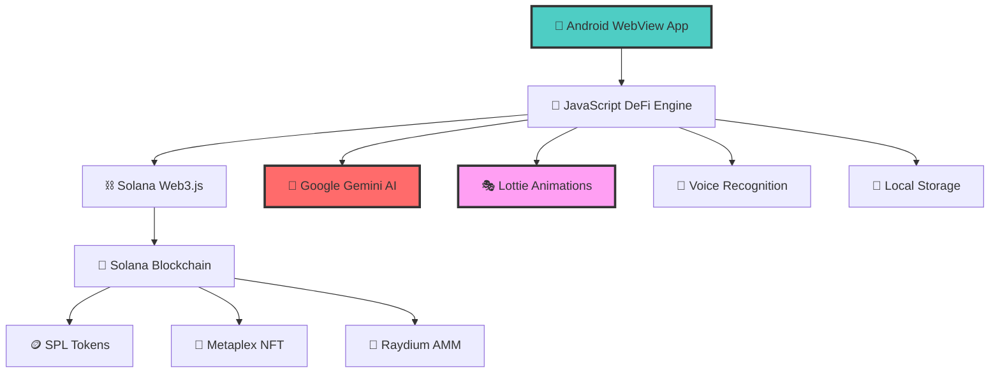

# 🚀 BIFE - Voice-First AI DeFi Ecosystem

<div align="center">

<!-- Cute Lottie Character Representation -->


[](https://github.com/johnnyduo/bife)
[](https://developer.android.com/)
[](https://solana.com/)
[](https://docs.solana.com/clusters#devnet)
[](https://gemini.google.com/)
[](LICENSE)

*Revolutionary Voice-First AI DeFi Platform with Adorable Animated Companions*

### 🎭 Meet Your AI DeFi Companions
```
    🚀 Astronaut Dog    🦄 Happy Unicorn    😊 Smiling Dog    🎨 Shiba Artist
       (Navigator)       (Analyst)          (Trader)         (Creator)
```

[🎯 Live Demo](#-live-demo) • [📋 Features](#-core-features) • [🏗️ Architecture](#-technical-architecture) • [🚀 Quick Start](#-quick-start) • [📚 Documentation](#-documentation)

</div>

---

## 📖 Table of Contents

- [🌟 Project Overview](#-project-overview)
- [🎯 Core Features](#-core-features)
- [🏗️ Technical Architecture](#-technical-architecture)
- [💰 Tokenomics & Economy](#-tokenomics--economy)
- [🤖 AI Companion System](#-ai-companion-system)
- [🎨 NFT Studio & Marketplace](#-nft-studio--marketplace)
- [📊 Advanced Trading Engine](#-advanced-trading-engine)
- [🔐 Security & Smart Contracts](#-security--smart-contracts)
- [📱 Mobile-First Experience](#-mobile-first-experience)
- [🚀 Quick Start Guide](#-quick-start-guide)
- [🛠️ Development Setup](#-development-setup)
- [📚 API Documentation](#-api-documentation)
- [🌐 Deployment](#-deployment)
- [🤝 Contributing](#-contributing)
- [📄 License](#-license)

---

## 🌟 Project Overview

**BIFE** (Bonk-powered Interactive Finance Ecosystem) is a next-generation DeFi platform that revolutionizes blockchain interaction through voice-first AI technology. Built on Solana's high-performance blockchain, BIFE combines professional-grade trading capabilities with intuitive voice commands, AI-powered portfolio analysis, and immersive animated companions.

### 🎯 Mission Statement

To democratize DeFi access by making complex blockchain operations as natural as having a conversation, while maintaining institutional-grade security and performance standards.

### 🏆 Key Differentiators

- **Voice-First Interface**: Natural language processing for all DeFi operations
- **AI-Powered Intelligence**: Real-time portfolio analysis with Google Gemini AI
- **Professional Trading Suite**: Direct integration with Raydium AMM and Jupiter aggregator
- **Animated AI Companions**: Interactive Lottie-based characters with personality
- **Mobile-Native Architecture**: Optimized Android WebView with native performance
- **Real Blockchain Integration**: Live transactions on Solana devnet with mainnet readiness
- **Advanced NFT Studio**: AI-generated artwork with on-chain minting capabilities
- **Comprehensive Yield Farming**: Multi-protocol staking and liquidity provision

### 📊 Project Statistics

| Metric | Value |
|--------|-------|
| **Blockchain** | Solana (Devnet/Mainnet Ready) |
| **Primary Language** | Kotlin/JavaScript (Hybrid) |
| **AI Integration** | Google Gemini AI |
| **Mobile Platform** | Android (iOS Ready) |
| **Smart Contracts** | SPL Token, Metaplex NFT |
| **Trading Integration** | Raydium AMM, Jupiter |
| **Animation Engine** | Lottie, Three.js |
| **Voice Recognition** | Android Speech API |

---

## 🎯 Core Features

### 🗣️ **Voice-First DeFi Operations**
- **Natural Language Trading**: "Swap 100 BONK to SOL"
- **Portfolio Queries**: "What's my current balance?"
- **Yield Farming Commands**: "Start farming in the SOL-USDC pool"
- **NFT Creation**: "Create a cyberpunk Shiba NFT"
- **Market Analysis**: "Analyze current market trends"

### 🤖 **AI-Powered Intelligent Analysis**
- **Real-time Portfolio Insights** with Google Gemini AI
- **Advanced Market Sentiment Analysis**
- **Predictive Trading Recommendations**
- **Risk Assessment & Portfolio Optimization**
- **Personalized Investment Strategies**

### 📊 **Professional Trading Suite**
- **Multi-DEX Aggregation**: Raydium, Jupiter, Orca
- **Advanced Order Types**: Limit, Stop-Loss, DCA
- **Real-time Price Feeds** from multiple sources
- **Slippage Protection** and MEV resistance
- **Professional Charts** with technical indicators

### 🎨 **Advanced NFT Studio**
- **AI-Generated Artwork** with customizable themes
- **On-Chain Minting** with Metaplex integration
- **Rarity System** with attribute-based scoring
- **Pagination System** for large collections
- **Solscan Integration** for verification
- **Marketplace Integration** ready

### 🌾 **Comprehensive Yield Farming**
- **Multi-Protocol Staking**: BONK, SOL, USDC
- **Liquidity Pool Participation** with auto-compounding
- **Yield Optimization** with AI recommendations
- **Risk-adjusted Returns** calculation
- **Real-time APY Tracking**

### 🏦 **Advanced Portfolio Management**
- **Real-time Balance Tracking** across multiple tokens
- **Historical Performance** charts and analytics
- **Profit/Loss Calculations** with tax reporting ready
- **Cross-platform Synchronization**
- **Export Capabilities** for accounting software

---

## 🏗️ Technical Architecture

> *"Where cute meets cutting-edge technology"* 🤖✨

### 🔧 **Core Technology Stack**



### 🎭 **Animation-First Frontend**
```
📱 Android Hybrid App
├── 🎨 Lottie Animation Engine (Our Cute Companions!)
│   ├── 🚀 AstronautDog.json ──► Space Navigation UI
│   ├── 🦄 Happy Unicorn Dog.json ──► Portfolio Magic
│   ├── 😊 Smiling Dog.json ──► Trading Happiness
│   └── 🎨 Shiba.json ──► NFT Creation Studio
├── 🎤 Voice Recognition ──► Natural Commands
├── 📱 Responsive Design ──► Mobile-First Experience
└── ⚡ Performance Optimized ──► 60fps Smooth Animations
```

### ⛓️ **Blockchain Integration**
```
🌊 Solana Ocean
├── 🔗 Web3.js Direct Integration
├── 🪙 SPL Token Magic (BONK & USDC)
├── 🎨 Metaplex NFT Factory
├── 🌊 Raydium Trading Waves
├── 🔍 Jupiter Price Discovery
└── 📊 Solscan Verification Portal
```

### 🧠 **AI & Voice Magic**
```
🤖 Intelligence Layer
├── 🧠 Google Gemini AI ──► Smart Conversations
├── 🎤 Natural Language Processing ──► Voice Commands
├── 💭 Context Awareness ──► Memory & Learning
├── 🎯 Smart Routing ──► Command Classification
└── 🛡️ Fallback Systems ──► Always Available
```

### 🎨 **Lottie Animation System**
```javascript
const animationMagic = {
  engine: "Lottie Web + React Native",
  companions: {
    "🚀 astronaut": {
      file: "AstronautDog.json",
      moods: ["exploring", "analyzing", "celebrating", "thinking"],
      triggers: ["portfolio_view", "market_analysis", "voice_command"]
    },
    "🦄 unicorn": {
      file: "Happy Unicorn Dog.json", 
      moods: ["magical", "dancing", "sparkling", "predicting"],
      triggers: ["profit_gain", "positive_trend", "ai_insight"]
    },
    "😊 smiling": {
      file: "Smiling Dog.json",
      moods: ["happy", "trading", "celebrating", "optimistic"],
      triggers: ["successful_trade", "price_alert", "profit_made"]
    },
    "🎨 shiba": {
      file: "Shiba.json",
      moods: ["creating", "painting", "inspiring", "artistic"],
      triggers: ["nft_creation", "art_generation", "collection_view"]
    }
  },
  performance: {
    fps: 60,
    memoryOptimized: true,
    batterySaver: true,
    adaptiveQuality: true
  }
}
```

### 🛡️ **Security Architecture**
- **Client-side Key Management**: Secure keypair generation
- **Transaction Signing**: Local signing with user confirmation
- **API Key Protection**: Environment-based configuration
- **Input Validation**: Comprehensive sanitization
- **Error Handling**: Graceful failure and recovery

---

## 💰 Tokenomics & Economy

### 🪙 **Supported Tokens**

| Token | Symbol | Decimals | Contract Address | Utility |
|-------|---------|----------|------------------|---------|
| **Mock BONK** | mBONK | 5 | `8wg7hAtfF1eJZLLb7TCHZhVuS3NkBdm8R7dtRPvn9BiP` | Primary trading & staking |
| **Mock USDC** | mUSDC | 6 | `9nccat6babNG1u32Xu6d8XojGy7BGH6shwCLzoCrZWTT` | Stable pair & liquidity |
| **Solana** | SOL | 9 | Native | Network fees & base pair |

### 💎 **BONK Token Utility**

#### 🔥 **Primary Use Cases**
- **Trading Fees**: Reduced fees when paid in BONK
- **Staking Rewards**: Up to 35.8% APY for staking
- **AI Feature Unlock**: Premium AI analysis requires 500K+ BONK stake
- **NFT Minting**: Discounted creation fees with BONK
- **Governance Rights**: DAO voting power proportional to stake

#### 📈 **Staking Economics**
```javascript
// Staking Tiers & Benefits
const stakingTiers = {
  basic: { 
    minimum: 100000,    // 100K BONK
    apy: 25.5,         // 25.5% APY
    features: ['Basic AI', 'Standard Trading']
  },
  premium: { 
    minimum: 500000,    // 500K BONK
    apy: 35.8,         // 35.8% APY
    features: ['Advanced AI', 'Priority Trading', 'Portfolio Analysis']
  },
  elite: { 
    minimum: 1000000,   // 1M BONK
    apy: 45.2,         // 45.2% APY
    features: ['Full AI Suite', 'MEV Protection', 'Early Access']
  }
}
```

### 💰 **Revenue Model**
- **Trading Fees**: 0.05% per transaction (reduced with BONK)
- **NFT Marketplace**: 2.5% commission on secondary sales
- **Premium AI**: Subscription model for advanced features
- **Yield Farming**: Performance fees on managed strategies
- **Partner Integration**: Revenue sharing with integrated protocols

### 🔄 **Liquidity Mechanisms**
- **Automated Market Making**: Raydium pool participation
- **Cross-DEX Arbitrage**: Jupiter aggregation for best prices
- **Liquidity Mining**: Rewards for LP token holders
- **Treasury Management**: Protocol-owned liquidity (POL)

---

## 🤖 AI Companion System

> *"Each companion is a living Lottie animation with unique personality and specialized DeFi expertise"*

### 🚀 **Astronaut Dog - Portfolio Navigator** 
<div align="center">

</div>

```javascript
const astronautFeatures = {
  personality: "🚀 Professional, analytical, space-themed explorer",
  specialization: "Portfolio analysis and market navigation",
  animations: ["🛰️ analyzing", "🎉 celebrating", "🤔 thinking", "✨ discovering"],
  voiceCommands: [
    "🚀 Analyze my portfolio",
    "📊 Show market trends", 
    "⚖️ Rebalance suggestions",
    "🌟 Navigate to trading"
  ],
  aiCapabilities: {
    riskAssessment: "🛡️ Advanced risk analysis",
    marketPrediction: "🔮 AI-powered forecasting",
    portfolioOptimization: "⚡ Smart rebalancing"
  },
  lottiePath: "assets/models/AstronautDog.json"
}
```

### 🦄 **Happy Unicorn Dog - Magical Analyst**
<div align="center">

</div>

```javascript
const unicornFeatures = {
  personality: "🦄 Creative, magical, optimistic fortune-teller",
  specialization: "AI-powered portfolio magic and predictions",
  animations: ["💃 dancing", "✨ sparkles", "🌈 creating", "🔮 predicting"],
  voiceCommands: [
    "🦄 Work your magic on my portfolio",
    "✨ Generate magical insights",
    "🌈 Show me the rainbow trends",
    "🔮 Predict market movements"
  ],
  aiCapabilities: {
    magicalAnalysis: "🪄 Mystical market insights",
    rainbowForecasts: "🌈 Colorful profit predictions",
    unicornPower: "💎 Rare gem opportunity detection"
  },
  lottiePath: "assets/models/Happy Unicorn Dog.json"
}
```

### 😊 **Smiling Dog - Happy Trading Specialist**
<div align="center">

</div>

```javascript
const tradingDogFeatures = {
  personality: "😊 Enthusiastic, confident, eternally optimistic trader",
  specialization: "Happy trading execution and positive market vibes",
  animations: ["📈 trading", "🎉 celebrating", "📊 analyzing", "💰 profit-dancing"],
  voiceCommands: [
    "😊 Execute my happy trade",
    "📈 Show me good market news",
    "💰 Find profitable opportunities",
    "🎯 Set positive price alerts"
  ],
  aiCapabilities: {
    happyTrading: "😊 Optimistic trade execution",
    positiveAnalysis: "📈 Bullish market sentiment",
    profitMagnet: "💰 Opportunity attraction algorithms"
  },
  lottiePath: "assets/models/Smiling Dog.json"
}
```

### 🎨 **Shiba Artist - Creative NFT Genius**
<div align="center">

</div>

```javascript
const shibaArtistFeatures = {
  personality: "🎨 Artistic, creative, imaginative NFT visionary",
  specialization: "AI-powered NFT creation and artistic inspiration",
  animations: ["🎨 painting", "✨ creating", "🖌️ designing", "🌟 inspiring"],
  voiceCommands: [
    "🎨 Create a masterpiece NFT",
    "✨ Generate artistic inspiration",
    "🖼️ Show my NFT collection",
    "🌈 Paint me something magical"
  ],
  aiCapabilities: {
    artGeneration: "🎨 AI-powered artwork creation",
    creativePrompts: "💡 Infinite inspiration generator",
    rarityMagic: "💎 Rarity scoring algorithms",
    styleTransfer: "🖌️ Artistic style transformations"
  },
  lottiePath: "assets/models/Shiba.json"
}
```

### 🎭 **AI Behavior System**
```
🧠 Context Awareness ──► 💭 Remembers previous conversations
❤️ Emotional Intelligence ──► 😊 Responds to user sentiment  
🎓 Learning Capability ──► 📈 Adapts to user preferences
🎮 Multi-modal Interaction ──► 🎤 Voice, text, and gesture recognition
🎭 Personality Consistency ──► ✨ Maintains character traits across sessions
```

### 🎪 **Animation Magic**
- **🎬 Lottie-Powered**: Smooth vector animations with personality
- **📱 Mobile Optimized**: 60fps performance on Android devices
- **🎨 Interactive**: Responds to user interactions and market changes
- **⚡ Smart Loading**: Efficient memory management and caching
- **🌈 Mood Adaptive**: Animations change based on portfolio performance

---

## 🎨 NFT Studio & Marketplace

> *"Where Shiba Artist brings your dreams to life with AI magic"* 🎨✨

### 🎯 **AI-Powered NFT Generation with Shiba Artist**

<div align="center">

</div>

#### 🎨 **Creative Elements System**
```javascript
const shibaCreativeStudio = {
  artist: "🎨 Shiba NFT Artist",
  studio: "AI-Powered Creative Workshop",
  
  names: [
    "🌌 Cosmic Shiba Explorer", "🛡️ Galactic Bonk Guardian",
    "⚔️ Stellar Inu Warrior", "🌟 Nebula Pup Adventures",
    "🔮 Quantum Shiba Dreams", "🚀 Astro Doge Legend"
  ],
  
  styles: [
    "🚀 astronaut", "👑 royal", "🥷 ninja", "🏴‍☠️ pirate", 
    "🧙 wizard", "🤖 cyber", "⚔️ samurai", "👨‍🍳 chef"
  ],
  
  backgrounds: [
    "🌌 space nebula", "🏙️ cyberpunk city", "🌲 enchanted forest",
    "🏰 underwater palace", "💎 crystal cave", "☁️ floating islands"
  ],
  
  accessories: [
    "👑 diamond crown", "🥽 laser goggles", "🪄 magic wand",
    "🎒 jetpack", "🦸 cape", "💎 golden collar"
  ],
  
  shibaPersonality: {
    mood: "🎨 Always creative and inspiring",
    catchphrase: "Let's paint the blockchain beautiful!",
    animations: ["🖌️ painting", "✨ creating", "🌈 inspiring", "🎭 designing"]
  }
}
```

#### 💎 **Rarity System - Shiba's Secret Formula**
```javascript
const shibaRarityMagic = {
  "💎 Legendary": { 
    weight: "12+", 
    probability: "1%", 
    shibaReaction: "🤩 OMG! We created a masterpiece!",
    traits: "✨ Ultra-rare magical combinations" 
  },
  "🔥 Epic": { 
    weight: "9-11", 
    probability: "5%", 
    shibaReaction: "🎉 Wow! This is epic art!",
    traits: "🌟 Rare style combinations" 
  },
  "💜 Rare": { 
    weight: "6-8", 
    probability: "15%", 
    shibaReaction: "😍 Beautiful rare creation!",
    traits: "🎨 Uncommon artistic attributes" 
  },
  "💙 Uncommon": { 
    weight: "3-5", 
    probability: "25%", 
    shibaReaction: "😊 Nice artistic touch!",
    traits: "🖼️ Some rare artistic traits" 
  },
  "💚 Common": { 
    weight: "1-2", 
    probability: "54%", 
    shibaReaction: "🙂 Lovely standard art!",
    traits: "🎭 Classic artistic attributes" 
  }
}
```

### 📄 **Pagination & Collection Management**
```
🖼️ NFT Gallery System
├── 📱 Mobile-Optimized ──► 6 NFTs per page for smooth scrolling
├── 💾 Smart Caching ──► LocalStorage with timestamp magic
├── ⚡ Real-time Updates ──► New NFTs appear instantly
├── 🔄 Cross-platform Sync ──► Consistent across devices
└── 📊 Export Functions ──► Portfolio reports and tax docs

🎨 Shiba Artist Features:
├── 🖌️ Live Art Generation ──► Watch Shiba create in real-time
├── 🎭 Animation Feedback ──► Shiba reacts to your NFT success
├── 🌈 Style Recommendations ──► AI suggests perfect combinations
└── 💎 Rarity Predictions ──► Preview rarity before minting
```

### 🔗 **Blockchain Integration with Cute Confirmations**
```javascript
const nftBlockchainMagic = {
  standard: "📜 Metaplex Token Metadata (Official NFT Standard)",
  storage: "🌐 IPFS Decentralized Storage",
  verification: "🔍 Solscan Integration for Authenticity",
  
  shibaWorkflow: {
    step1: "🎨 Shiba Artist creates your masterpiece",
    step2: "💾 Artwork uploaded to IPFS galaxy", 
    step3: "⛓️ Metadata anchored on Solana blockchain",
    step4: "🎉 Shiba celebrates your new NFT!",
    step5: "🖼️ Added to your collection with animations"
  },
  
  marketplaceReady: {
    transfers: "🔄 Built-in send/receive with cute animations",
    integration: "🏪 Ready for secondary market magic",
    royalties: "💰 Creator fees enforced on-chain"
  }
}
```

### 📊 **Analytics & Insights with Companion Reactions**
```
📈 NFT Performance Dashboard
├── 🎨 Creation Statistics ──► Track your artistic journey
├── 💎 Rarity Analysis ──► Real-time market positioning  
├── 📊 Performance Tracking ──► Value appreciation charts
└── 🌟 Community Features ──► Social sharing with companions

🎭 Companion Reactions:
├── 🚀 Astronaut Dog ──► "Your NFT portfolio is stellar!"
├── 🦄 Happy Unicorn ──► "Magical NFT gains detected!"
├── 😊 Smiling Dog ──► "Your art makes me so happy!"
└── 🎨 Shiba Artist ──► "We're creating blockchain history!"
```

---

## 📊 Advanced Trading Engine

### 🔄 **Multi-DEX Aggregation**

#### 🌊 **Supported Exchanges**
```javascript
const supportedDEXs = {
  raydium: {
    name: "Raydium AMM",
    type: "Automated Market Maker",
    integration: "Direct SDK",
    features: ["LP provision", "Yield farming", "Price discovery"]
  },
  jupiter: {
    name: "Jupiter Aggregator",
    type: "DEX Aggregator",
    integration: "API",
    features: ["Best price routing", "MEV protection", "Slippage optimization"]
  },
  orca: {
    name: "Orca DEX",
    type: "Concentrated Liquidity",
    integration: "API",
    features: ["Concentrated LPs", "Fee tiers", "Capital efficiency"]
  }
}
```

### 📈 **Advanced Order Types**
- **Market Orders**: Instant execution at current prices
- **Limit Orders**: Execute at specific price targets
- **Stop-Loss Orders**: Automatic risk management
- **Dollar-Cost Averaging**: Automated recurring purchases
- **Take-Profit Orders**: Automated profit realization

### 🛡️ **Risk Management**
```javascript
const riskManagement = {
  slippageProtection: {
    default: 0.5,      // 0.5% default slippage
    maximum: 5.0,      // 5% maximum allowed
    dynamic: true      // Adjust based on market conditions
  },
  positionSizing: {
    maxPerTrade: 10,   // 10% of portfolio per trade
    riskPerTrade: 2,   // 2% risk per trade
    stopLoss: 5        // 5% stop loss from entry
  },
  mevProtection: {
    enabled: true,
    techniques: ["Private mempool", "Randomized timing", "Bundle submission"]
  }
}
```

### 📊 **Real-time Market Data**
- **Multi-source Price Feeds**: CoinGecko, Jupiter, Birdeye
- **Technical Indicators**: RSI, MACD, Bollinger Bands
- **Volume Analysis**: 24h volume and liquidity metrics
- **Historical Data**: Price charts and trading history
- **Market Sentiment**: Fear & Greed index integration

### 🔮 **AI-Powered Trading Insights**
```javascript
const tradingAI = {
  marketAnalysis: {
    sentimentAnalysis: "Social media and news sentiment",
    technicalAnalysis: "Chart pattern recognition",
    fundamentalAnalysis: "Token metrics and project health"
  },
  recommendations: {
    entryPoints: "Optimal buy zones based on AI analysis",
    exitStrategies: "Profit-taking and stop-loss recommendations",
    portfolioRebalancing: "Allocation optimization suggestions"
  },
  riskAssessment: {
    volatilityForecasting: "Expected price volatility",
    correlationAnalysis: "Asset correlation insights",
    liquidityAssessment: "Market depth and slippage estimates"
  }
}
```

---

## 🔐 Security & Smart Contracts

### 🛡️ **Security Architecture**

#### 🔒 **Key Management**
```javascript
const securityFeatures = {
  keyGeneration: {
    algorithm: "Ed25519",
    entropy: "Browser crypto.getRandomValues()",
    storage: "Local device only",
    backup: "Manual seed phrase export"
  },
  transactionSigning: {
    location: "Client-side only",
    confirmation: "User approval required",
    verification: "Signature validation",
    broadcast: "Direct to Solana RPC"
  },
  apiSecurity: {
    keyRotation: "Environment-based management",
    rateLimit: "Request throttling",
    validation: "Input sanitization",
    encryption: "TLS 1.3 in transit"
  }
}
```

### 📝 **Smart Contract Integration**

#### 🪙 **SPL Token Operations**
```javascript
const tokenOperations = {
  deployment: {
    program: "TokenkegQfeZyiNwAJbNbGKPFXCWuBvf9Ss623VQ5DA",
    functions: ["createMint", "createAccount", "mintTo", "transfer"]
  },
  security: {
    authority: "Multi-signature recommended",
    freezeAccount: "Emergency controls",
    mintAuthority: "Controlled supply management"
  }
}
```

#### 🎨 **Metaplex NFT Standard**
```javascript
const nftOperations = {
  minting: {
    standard: "Metaplex Token Metadata Program",
    storage: "IPFS decentralized storage",
    metadata: "JSON schema compliant",
    royalties: "Creator fee enforcement"
  },
  verification: {
    onChain: "Blockchain immutable record",
    metadata: "IPFS content addressing",
    authenticity: "Creator signature verification"
  }
}
```

### 🔍 **Audit & Compliance**
- **Code Audits**: Regular security assessments
- **Dependency Scanning**: Automated vulnerability detection
- **Penetration Testing**: Third-party security validation
- **Compliance**: AML/KYC integration ready
- **Documentation**: Comprehensive security procedures

### 🚨 **Emergency Procedures**
```javascript
const emergencyProtocols = {
  circuitBreakers: {
    priceDeviations: "Halt trading on extreme moves",
    volumeSpikes: "Limit position sizes during volatility",
    systemFailures: "Graceful degradation and recovery"
  },
  fundRecovery: {
    seedPhrase: "Manual wallet recovery",
    timelock: "Emergency access procedures",
    multiSig: "Governance-controlled recovery"
  }
}
```

---

## 📱 Mobile-First Experience

### 🔧 **Android Architecture**

#### 📱 **Hybrid App Design**
```kotlin
class MainActivity : Activity() {
    // Native Android components
    private lateinit var webView: WebView
    private lateinit var speechRecognizer: SpeechRecognizer
    
    // JavaScript bridge for DeFi operations
    @JavascriptInterface
    fun getGeminiApiKey(): String { /* Secure API key management */ }
    
    @JavascriptInterface
    fun openExternalBrowser(url: String) { /* External link handling */ }
    
    @JavascriptInterface
    fun shareContent(text: String) { /* Native sharing */ }
}
```

### 🎨 **Responsive Design System**
```css
/* Mobile-first responsive breakpoints */
.responsive-grid {
  display: grid;
  grid-template-columns: repeat(auto-fit, minmax(300px, 1fr));
  gap: 16px;
  padding: 16px;
}

@media (max-width: 768px) {
  .responsive-grid {
    grid-template-columns: repeat(2, 1fr);
    gap: 12px;
    padding: 12px;
  }
}
```

### 🗣️ **Voice Interface Optimization**
- **Low-latency Recognition**: Optimized speech processing
- **Noise Cancellation**: Background noise filtering
- **Context Awareness**: Multi-turn conversation support
- **Offline Capability**: Basic commands without internet
- **Accessibility**: Screen reader and voice navigation support

### ⚡ **Performance Optimization**
```javascript
const performanceOptimizations = {
  lazyLoading: {
    images: "Intersection Observer API",
    animations: "Load on demand",
    data: "Pagination and virtualization"
  },
  caching: {
    localStorage: "5-minute cache for balances",
    sessionStorage: "Temporary transaction data",
    indexedDB: "Large data sets and history"
  },
  networking: {
    debouncing: "API call optimization",
    compression: "GZIP response compression",
    cdn: "Static asset delivery"
  }
}
```

### 🔄 **Offline Capabilities**
- **Cached Data**: Last known balances and prices
- **Queue System**: Delayed transaction execution
- **Sync Management**: Automatic sync on reconnection
- **Error Handling**: Graceful offline state indication

---

## 🚀 Quick Start Guide

> *"Let your AI companions guide you to DeFi success!"* 🌟

### 🎭 **Meet Your Guides First**
Before we start, meet your adorable AI companions who will help you throughout your journey:

<div align="center">

| � **Astronaut Dog** | 🦄 **Happy Unicorn** | 😊 **Smiling Dog** | 🎨 **Shiba Artist** |
|:---:|:---:|:---:|:---:|
| *"Ready for launch!"* | *"Magic awaits!"* | *"Let's trade happily!"* | *"Art time!"* |
| Navigation Expert | Portfolio Wizard | Trading Specialist | NFT Creator |

</div>

### �📋 **Prerequisites**

```bash
# Required Software (Your Companions Will Thank You! 😊)
- Android Studio Arctic Fox+ (for Android development) 🤖
- Node.js 16+ (for dependency management) 📦  
- Java 11+ (for Android compilation) ☕
- Yarn (package manager) 🧶
- Git (version control) 🌲

# Optional but Recommended (For Extra Fun! ✨)
- Android Device/Emulator with API 24+ 📱
- Solana CLI tools ⛓️
- VS Code with Solana extension 💻
```

### ⚡ **Installation Steps**

#### 1️⃣ **Clone Repository** 
```bash
# 🚀 Astronaut Dog says: "Let's start our space mission!"
git clone https://github.com/johnnyduo/bife.git
cd bife
```

#### 2️⃣ **Install Dependencies**
```bash
# 🦄 Happy Unicorn says: "Time for some magical dependency installation!"
yarn install

# Install Solana token dependencies  
cd solana-tokens
yarn install
cd ..
```

#### 3️⃣ **Environment Configuration**
```bash
# 😊 Smiling Dog says: "Let's set up your environment happily!"
cp android/local.properties.example android/local.properties
cp .env.example .env

# Configure API keys (optional but recommended for full magic ✨)
export GEMINI_API_KEY="your_gemini_api_key_here"
export SOLSCAN_API_KEY="your_solscan_api_key_here"
```

#### 4️⃣ **Setup Solana Tokens (Optional)**
```bash
# 🎨 Shiba Artist says: "Let's create some tokens for our artistic trading!"
cd solana-tokens

# Setup wallet for token deployment
yarn setup-wallet

# Deploy mock tokens to devnet  
yarn create-tokens

# Check deployment status
yarn check-balance

cd ..
```

#### 5️⃣ **Build & Run Android App**
```bash
# 🚀 Astronaut Dog says: "Final countdown! Let's launch!"
cd android

# Build the application
./gradlew build

# Install on connected device/emulator
./gradlew installDebug

# Or run with live reload (Advanced Space Mission Mode! 🚀)
./gradlew installDebug && adb shell am start -n com.bife/.MainActivity
```

### 🎯 **First-Time Setup - Companion Guided Tour**

1. **🚀 Launch the App** - *Astronaut Dog will greet you!*
   ```
   "Welcome to BIFE Space Station! Let's explore the DeFi universe together!" 🚀
   ```

2. **🔗 Connect Wallet** - *The app will generate a devnet wallet*
   ```
   🦄 Happy Unicorn: "Magical wallet creation in progress... ✨"
   ```

3. **💰 Request Airdrop** - *Get free SOL for testing*
   ```
   😊 Smiling Dog: "Free SOL coming your way! Trading time! 💰"
   ```

4. **🎪 Explore Features** - *Your companions will guide each step:*
   
   **🎤 Voice Commands:**
   ```
   🚀 Try saying: "Show my portfolio" 
   → Astronaut Dog will navigate you instantly!
   ```
   
   **🎨 Create an NFT:**
   ```
   🎨 Try saying: "Generate a space-themed NFT"
   → Shiba Artist will start creating immediately!
   ```
   
   **💱 Execute a Trade:**
   ```
   😊 Try saying: "Swap 10 SOL to BONK"
   → Smiling Dog will execute with happiness!
   ```
   
   **💎 Stake Tokens:**
   ```
   🦄 Try saying: "Stake 100000 BONK"
   → Happy Unicorn will work magic on your rewards!
   ```

### 🔧 **Development Mode - Advanced Companion Features**

```bash
# 🚀 Astronaut Dog's Advanced Space Mode
adb shell setprop debug.bife.dev true

# 🔍 View real-time logs (See what your companions are thinking!)
adb logcat -s BifeApp

# 🎭 Fresh start (Reset all companion memories)
adb shell pm clear com.bife
```

### 🎉 **Success Celebration**
When everything is running, your companions will celebrate:

```
🚀 Astronaut Dog: "Mission accomplished! DeFi space station is operational!" 
🦄 Happy Unicorn: "Magical setup complete! Ready for portfolio wizardry!" ✨
😊 Smiling Dog: "Everything looks perfect! Happy trading ahead!" 😄
🎨 Shiba Artist: "Creative studio ready! Let's make beautiful NFTs!" 🎨
```

### 🆘 **Need Help?**
Your AI companions are always here to help:
- **🚀 Navigation Issues**: Ask Astronaut Dog
- **📊 Portfolio Questions**: Consult Happy Unicorn  
- **💱 Trading Problems**: Chat with Smiling Dog
- **🎨 NFT Creation**: Work with Shiba Artist

*Just use voice commands or check the in-app help guides!* 💫

---

## 🛠️ Development Setup

### 🏗️ **Project Structure**

```
bife/
├── android/                    # Android native app
│   ├── app/src/main/java/     # Kotlin source code
│   ├── app/build.gradle       # Android build configuration
│   └── gradlew               # Gradle wrapper
├── solana-tokens/            # Token deployment scripts
│   ├── scripts/              # Deployment automation
│   ├── token-addresses.json  # Deployed token info
│   └── package.json          # Solana dependencies
├── assets/                   # Static assets
│   ├── animations/           # Lottie animation files
│   └── models/              # 3D models and textures
├── package.json             # Main project dependencies
├── app.json                 # Expo configuration
└── README.md               # This file
```

### 🔧 **Build Configuration**

#### 📱 **Android Build Settings**
```gradle
// android/app/build.gradle
android {
    compileSdkVersion 34
    buildToolsVersion "34.0.0"
    
    defaultConfig {
        applicationId "com.bife"
        minSdkVersion 24
        targetSdkVersion 34
        versionCode 300
        versionName "3.0.0"
    }
    
    buildTypes {
        debug {
            debuggable true
            minifyEnabled false
        }
        release {
            minifyEnabled true
            proguardFiles getDefaultProguardFile('proguard-android.txt'), 'proguard-rules.pro'
        }
    }
}
```

#### ⚙️ **Environment Variables**
```bash
# Required for full functionality
GEMINI_API_KEY=your_google_gemini_api_key
SOLSCAN_API_KEY=your_solscan_api_key
JUPITER_API_KEY=your_jupiter_api_key

# Optional for enhanced features
PINATA_API_KEY=your_pinata_ipfs_key
BIRDEYE_API_KEY=your_birdeye_api_key
HELIUS_API_KEY=your_helius_rpc_key
```

### 🧪 **Testing Framework**

```bash
# Run unit tests
yarn test

# Run Android instrumentation tests
cd android && ./gradlew connectedAndroidTest

# Run integration tests
yarn test:integration

# Performance testing
yarn test:performance
```

### 📊 **Development Tools**

#### 🔍 **Debugging**
```javascript
// Enable debug mode in app
localStorage.setItem('bifeDebugMode', 'true');

// View detailed logs
console.log('Debug mode enabled');

// Network monitoring
window.bifeDebug = {
  logTransactions: true,
  logApiCalls: true,
  logVoiceCommands: true
};
```

#### 📈 **Performance Monitoring**
```javascript
// Performance metrics
const performanceMonitor = {
  measureApiLatency: true,
  trackMemoryUsage: true,
  monitorBatteryUsage: true,
  logRenderTimes: true
};
```

---

## 📚 API Documentation

### 🔗 **Core API Endpoints**

#### 🪙 **Token Operations**
```javascript
// Get token balances
const balances = await fetchTokenBalances();

// Execute token transfer
const transfer = await transferTokens({
  from: walletAddress,
  to: recipientAddress,
  amount: transferAmount,
  token: tokenMint
});

// Swap tokens
const swap = await executeSwap({
  inputToken: 'SOL',
  outputToken: 'BONK',
  amount: swapAmount,
  slippage: 0.5
});
```

#### 🎨 **NFT Operations**
```javascript
// Create NFT metadata
const metadata = await createNFTMetadata({
  name: nftName,
  description: nftDescription,
  image: artworkUrl,
  attributes: nftAttributes
});

// Mint NFT on-chain
const nft = await mintNFT({
  metadata: metadataUri,
  recipient: walletAddress,
  royalty: creatorRoyalty
});

// Get NFT collection
const collection = await getUserNFTCollection(walletAddress);
```

#### 🗣️ **Voice Interface**
```javascript
// Process voice command
const response = await processVoiceCommand(transcript);

// Execute AI command
const result = await executeAICommand({
  command: originalCommand,
  context: conversationContext,
  aiResponse: geminiResponse
});

// Get voice status
const status = getVoiceRecognitionStatus();
```

### 🧠 **AI Integration**

#### 🤖 **Gemini AI API**
```javascript
// Send prompt to Gemini
const aiResponse = await sendToGeminiAdvanced({
  prompt: userPrompt,
  context: conversationHistory,
  model: 'gemini-pro'
});

// Generate trading analysis
const analysis = await performTradingAnalysis({
  portfolio: userPortfolio,
  marketData: currentMarket,
  timeframe: analysisTimeframe
});
```

### 📊 **Market Data API**

#### 💹 **Price Feeds**
```javascript
// Real-time prices
const prices = await fetchRealTimePrices(['SOL', 'BONK', 'USDC']);

// Historical data
const history = await fetchPriceHistory({
  symbol: 'SOL',
  timeframe: '24h',
  interval: '1m'
});

// Market statistics
const stats = await fetchMarketStats({
  tokens: ['SOL', 'BONK'],
  metrics: ['volume', 'marketCap', 'change24h']
});
```

### 🔐 **Authentication & Security**

#### 🔑 **Wallet Integration**
```javascript
// Connect wallet
const wallet = await connectSolanaWallet();

// Sign transaction
const signature = await wallet.signTransaction(transaction);

// Verify signature
const isValid = await verifyTransactionSignature(signature, publicKey);
```

---

## 🌐 Deployment

### 🚀 **Production Deployment**

#### 🏭 **Build for Production**
```bash
# Clean previous builds
cd android && ./gradlew clean

# Build release APK
./gradlew assembleRelease

# Build Android App Bundle (for Play Store)
./gradlew bundleRelease

# Sign APK for distribution
jarsigner -verbose -sigalg SHA1withRSA -digestalg SHA1 -keystore bife-release-key.keystore app-release-unsigned.apk bife-key
```

#### ☁️ **Cloud Infrastructure**
```yaml
# deployment.yml
apiVersion: apps/v1
kind: Deployment
metadata:
  name: bife-backend
spec:
  replicas: 3
  selector:
    matchLabels:
      app: bife-backend
  template:
    metadata:
      labels:
        app: bife-backend
    spec:
      containers:
      - name: bife-api
        image: bife/backend:latest
        ports:
        - containerPort: 3000
        env:
        - name: SOLANA_RPC_URL
          value: "https://api.mainnet-beta.solana.com"
        - name: GEMINI_API_KEY
          valueFrom:
            secretKeyRef:
              name: bife-secrets
              key: gemini-api-key
```

### 📱 **Mobile Distribution**

#### 🏪 **Google Play Store**
```bash
# Prepare for Play Store submission
1. Update version in build.gradle
2. Generate signed AAB
3. Create Play Store listing
4. Submit for review

# Play Store configuration
android {
    bundle {
        language {
            enableSplit = true
        }
        density {
            enableSplit = true
        }
        abi {
            enableSplit = true
        }
    }
}
```

#### 🔧 **Alternative Distribution**
```bash
# Direct APK distribution
1. Host APK on secure CDN
2. Implement update notification
3. Support auto-update mechanism
4. Maintain version compatibility

# Enterprise distribution
1. Sign with enterprise certificate
2. Configure MDM integration
3. Implement policy compliance
4. Support remote management
```

### 🌍 **Mainnet Migration**

#### ⛓️ **Blockchain Configuration**
```javascript
// Mainnet configuration
const mainnetConfig = {
  rpcUrl: 'https://api.mainnet-beta.solana.com',
  commitment: 'confirmed',
  tokens: {
    BONK: 'DezXAZ8z7PnrnRJjz3wXBoRgixCa6xjnB7YaB1pPB263',
    USDC: 'EPjFWdd5AufqSSqeM2qN1xzybapC8G4wEGGkZwyTDt1v',
    SOL: 'So11111111111111111111111111111111111111112'
  },
  dexes: {
    raydium: 'https://api.raydium.io',
    jupiter: 'https://quote-api.jup.ag',
    orca: 'https://api.orca.so'
  }
};
```

### 📊 **Monitoring & Analytics**

#### 📈 **Performance Monitoring**
```javascript
// Application monitoring
const monitoring = {
  errorTracking: 'Sentry integration',
  performanceAPM: 'DataDog or New Relic',
  userAnalytics: 'Mixpanel or Amplitude',
  blockchainMetrics: 'Custom Solana monitoring'
};

// Key metrics to track
const kpis = {
  userEngagement: ['DAU', 'MAU', 'Session duration'],
  tradingMetrics: ['Volume', 'Trades', 'Slippage'],
  technicalMetrics: ['Latency', 'Uptime', 'Error rate'],
  businessMetrics: ['Revenue', 'TVL', 'User growth']
};
```

---

## 🤝 Contributing

### 🎯 **Contribution Guidelines**

#### 🔄 **Development Workflow**
```bash
# 1. Fork the repository
git fork https://github.com/johnnyduo/bife

# 2. Create feature branch
git checkout -b feature/new-trading-feature

# 3. Make changes and test
yarn test && yarn lint

# 4. Commit with conventional commits
git commit -m "feat(trading): add limit order functionality"

# 5. Push and create PR
git push origin feature/new-trading-feature
```

#### 📝 **Code Standards**
```javascript
// JavaScript/TypeScript standards
const codeStandards = {
  style: 'Prettier with custom config',
  linting: 'ESLint with Airbnb base',
  testing: 'Jest with minimum 80% coverage',
  documentation: 'JSDoc for all public APIs',
  commits: 'Conventional Commits specification'
};
```

#### 🧪 **Testing Requirements**
```bash
# All contributions must include:
1. Unit tests for new functions
2. Integration tests for API changes
3. End-to-end tests for user flows
4. Performance benchmarks for critical paths
5. Security tests for wallet operations
```

### 🐛 **Bug Reports**

```markdown
## Bug Report Template

### Description
A clear description of the bug

### Steps to Reproduce
1. Step one
2. Step two
3. Step three

### Expected Behavior
What should happen

### Actual Behavior
What actually happens

### Environment
- Device: [Android model]
- OS Version: [Android version]
- App Version: [BIFE version]
- Network: [Mainnet/Devnet]

### Logs
Include relevant console logs or screenshots
```

### 💡 **Feature Requests**

```markdown
## Feature Request Template

### Summary
Brief description of the feature

### Motivation
Why is this feature needed?

### Detailed Description
Comprehensive explanation of the feature

### Implementation Suggestions
Technical implementation ideas

### Acceptance Criteria
- [ ] Criterion 1
- [ ] Criterion 2
- [ ] Criterion 3
```

### 🏆 **Recognition**

```javascript
// Contributor recognition program
const contributorProgram = {
  levels: {
    bronze: { commits: 5, rewards: 'Discord role + NFT' },
    silver: { commits: 20, rewards: 'Early access + bonus tokens' },
    gold: { commits: 50, rewards: 'Governance voting + premium features' },
    diamond: { commits: 100, rewards: 'Core team invite + equity' }
  },
  specialRoles: {
    securityExpert: 'Security vulnerability findings',
    uiuxDesigner: 'Design and user experience improvements',
    blockchainDev: 'Smart contract and blockchain contributions',
    communityLead: 'Community management and growth'
  }
};
```

---

## 📄 License

### 📋 **MIT License**

```
MIT License

Copyright (c) 2025 BIFE Team

Permission is hereby granted, free of charge, to any person obtaining a copy
of this software and associated documentation files (the "Software"), to deal
in the Software without restriction, including without limitation the rights
to use, copy, modify, merge, publish, distribute, sublicense, and/or sell
copies of the Software, and to permit persons to whom the Software is
furnished to do so, subject to the following conditions:

The above copyright notice and this permission notice shall be included in all
copies or substantial portions of the Software.

THE SOFTWARE IS PROVIDED "AS IS", WITHOUT WARRANTY OF ANY KIND, EXPRESS OR
IMPLIED, INCLUDING BUT NOT LIMITED TO THE WARRANTIES OF MERCHANTABILITY,
FITNESS FOR A PARTICULAR PURPOSE AND NONINFRINGEMENT. IN NO EVENT SHALL THE
AUTHORS OR COPYRIGHT HOLDERS BE LIABLE FOR ANY CLAIM, DAMAGES OR OTHER
LIABILITY, WHETHER IN AN ACTION OF CONTRACT, TORT OR OTHERWISE, ARISING FROM,
OUT OF OR IN CONNECTION WITH THE SOFTWARE OR THE USE OR OTHER DEALINGS IN THE
SOFTWARE.
```

### ⚖️ **Third-Party Licenses**

```javascript
const thirdPartyLicenses = {
  solanaWeb3: 'Apache License 2.0',
  metaplexFoundation: 'Apache License 2.0',
  googleGemini: 'Google AI Terms of Service',
  lottieFiles: 'MIT License',
  androidSDK: 'Android Software Development Kit License',
  kotlin: 'Apache License 2.0'
};
```

---

## 📞 Contact & Support

### 🌐 **Community Links**

<div align="center">

🎭 **Join Our Companion Community** �

| Platform | Link | Companion Guide |
|:--------:|:----:|:---------------:|
| �🌍 **Website** | [https://bife.app](https://bife.app) | 🚀 *Astronaut Dog's Home Base* |
| 📱 **GitHub** | [https://github.com/johnnyduo/bife](https://github.com/johnnyduo/bife) | 🎨 *Shiba Artist's Code Gallery* |
| 💬 **Discord** | [https://discord.gg/bife](https://discord.gg/bife) | 😊 *Smiling Dog's Happy Chat* |
| 🐦 **Twitter** | [https://twitter.com/BifeApp](https://twitter.com/BifeApp) | 🦄 *Happy Unicorn's Magic Updates* |
| 📱 **Telegram** | [https://t.me/BifeOfficial](https://t.me/BifeOfficial) | 🚀 *Space Mission Communications* |

</div>

### 📧 **Contact Information**

```
🎯 Your AI Companions Are Here to Help!

💼 Business Inquiries ──► business@bife.app
   � Astronaut Dog: "Ready for business partnerships!"

�🛠️ Technical Support ──► dev@bife.app  
   🎨 Shiba Artist: "Let's fix any creative bugs!"

🔒 Security Concerns ──► security@bife.app
   😊 Smiling Dog: "Keeping your assets safe and happy!"

🤝 Partnerships ──► partners@bife.app
   🦄 Happy Unicorn: "Magical collaborations await!"
```

### 🆘 **Support Resources**

<div align="center">

| Resource | Description | Companion Helper |
|:--------:|:-----------:|:----------------:|
| 📚 **Documentation** | [https://docs.bife.app](https://docs.bife.app) | 🚀 *Complete Space Manual* |
| ❓ **FAQ** | [https://bife.app/faq](https://bife.app/faq) | 😊 *Happy Answers* |
| 🎫 **Support Tickets** | [https://support.bife.app](https://support.bife.app) | 🦄 *Magic Problem Solver* |
| 📖 **Developer Guide** | [https://dev.bife.app](https://dev.bife.app) | 🎨 *Creative Dev Resources* |

</div>

### 🎪 **Community Guidelines**

```
🎭 Our Companion Community Values:

🚀 Be Exploratory ──► Like Astronaut Dog, always ready to discover
🦄 Spread Magic ──► Like Happy Unicorn, bring positivity everywhere  
😊 Stay Happy ──► Like Smiling Dog, keep the vibes positive
🎨 Create Beauty ──► Like Shiba Artist, make the space more beautiful

💫 Remember: We're all here to democratize DeFi with cute companions! 💫
```

---

<div align="center">

### 🚀 **Ready to revolutionize DeFi with adorable AI companions?**


[Get Started Now](#-quick-start-guide) • [Join Community](https://discord.gg/bife) • [Read Docs](https://docs.bife.app)

---

**Made with ❤️ by the BIFE Team & Our Adorable AI Companions**

```
🚀 Astronaut Dog: "Mission accomplished! Welcome to the DeFi universe!" 
🦄 Happy Unicorn: "Magical adventures await! ✨"
😊 Smiling Dog: "Happy trading and positive vibes! 😄"  
🎨 Shiba Artist: "Let's paint the blockchain beautiful! 🎨"
```

*Democratizing DeFi through Voice-First AI Technology & Cute Companions* 💫

</div>
- **Secure Architecture**: Environment-based token management

---

## ✨ Core Features

### 🎤 Voice AI System
- **Natural Language Processing**: Powered by Google Gemini AI
- **Multi-Language Support**: English voice commands with AI interpretation
- **Context-Aware Responses**: Understands DeFi terminology and operations
- **Real-Time Transcription**: Live voice-to-text with immediate feedback

### 📊 Advanced Trading Engine
- **Raydium Integration**: Direct AMM trading with real-time quotes
- **Multi-Token Support**: SOL, BONK, USDC with dynamic pricing
- **Smart Slippage Management**: Automatic slippage calculation and protection
- **Transaction Simulation**: Comprehensive pre-execution validation

### 🤖 AI Companion Gallery
- **Astronaut Dog**: Space-themed portfolio navigator
- **Happy Unicorn**: Magical portfolio analyst with ML insights
- **Smiling Dog**: Optimistic trading expert with market analysis
- **Shiba NFT Artist**: Creative NFT generation and management

### 🔗 Blockchain Infrastructure
- **Solana Network**: High-performance, low-cost transactions
- **Mobile Wallet Adapter**: Seamless wallet connectivity
- **Custom Token Deployment**: Live devnet tokens with real trading
- **Explorer Integration**: Direct links to Solscan and Solana Explorer

---

## 🏗️ Technical Architecture

### 📱 Frontend Architecture
```
Android Native WebView
├── HTML5/CSS3/JavaScript
├── Lottie Animation Engine
├── Real-time Voice Recognition
└── WebView-to-Native Bridge
```

### 🔧 Backend Integration
```
Solana Blockchain
├── Web3.js Integration
├── Mobile Wallet Adapter
├── Raydium AMM Protocol
└── Jupiter Aggregator API
```

### 🧠 AI/ML Stack
```
Google Gemini AI
├── Natural Language Processing
├── Context-Aware Responses
├── Portfolio Analysis
└── Trading Recommendations
```

### 🎨 Animation System
```
Lottie Animation Framework
├── Vector-based Companions
├── Performance Optimization
├── Device-Adaptive Rendering
└── Interactive Gestures
```

---

## 🪙 Deployed Tokens

### 📈 Token Specifications

#### BONK Token (mBONK)
```json
{
  "name": "Mock BONK",
  "symbol": "mBONK",
  "decimals": 5,
  "mint": "8wg7hAtfF1eJZLLb7TCHZhVuS3NkBdm8R7dtRPvn9BiP",
  "supply": "93,000,000,000,000",
  "network": "devnet",
  "authority": "5qX8VcUJGhHwXuVUknPa2TuQoKffWZnk5HPNUeUbpJnA"
}
```

#### USDC Token (mUSDC)
```json
{
  "name": "Mock USD Coin",
  "symbol": "mUSDC",
  "decimals": 6,
  "mint": "9nccat6babNG1u32Xu6d8XojGy7BGH6shwCLzoCrZWTT",
  "supply": "10,000,000",
  "network": "devnet",
  "authority": "5qX8VcUJGhHwXuVUknPa2TuQoKffWZnk5HPNUeUbpJnA"
}
```

### 🔗 Token Explorer Links
- **BONK Explorer**: [View on Solscan](https://solscan.io/token/8wg7hAtfF1eJZLLb7TCHZhVuS3NkBdm8R7dtRPvn9BiP?cluster=devnet)
- **USDC Explorer**: [View on Solscan](https://solscan.io/token/9nccat6babNG1u32Xu6d8XojGy7BGH6shwCLzoCrZWTT?cluster=devnet)
- **Deployer Wallet**: [View on Solscan](https://solscan.io/account/5qX8VcUJGhHwXuVUknPa2TuQoKffWZnk5HPNUeUbpJnA?cluster=devnet)

### 💱 Liquidity Pools
- **SOL-BONK Pool**: [Trade on Raydium](https://raydium.io/swap/?inputMint=sol&outputMint=8wg7hAtfF1eJZLLb7TCHZhVuS3NkBdm8R7dtRPvn9BiP)
- **USDC-BONK Pool**: [Trade on Raydium](https://raydium.io/swap/?inputMint=9nccat6babNG1u32Xu6d8XojGy7BGH6shwCLzoCrZWTT&outputMint=8wg7hAtfF1eJZLLb7TCHZhVuS3NkBdm8R7dtRPvn9BiP)

---

## 🤖 AI Companions

### 🚀 Astronaut Dog - Space Navigator
**Role**: Primary companion and voice interface
- **Capabilities**: Voice command processing, space-themed responses
- **Animation**: Astronaut-themed Lottie with space effects
- **Specialization**: Navigation and general DeFi guidance

### 🦄 Happy Unicorn - Portfolio Analyst
**Role**: AI-powered portfolio management
- **Capabilities**: ML-based portfolio analysis, prediction algorithms
- **Animation**: Magical unicorn with sparkle effects
- **Specialization**: Portfolio optimization and risk assessment

### 😊 Smiling Dog - Trading Expert
**Role**: Advanced trading and market analysis
- **Capabilities**: Real-time market data, trading strategy suggestions
- **Animation**: Optimistic dog with trading indicators
- **Specialization**: Swap execution and market sentiment analysis

### 🎨 Shiba NFT Artist - Creative Companion
**Role**: NFT creation and digital art generation
- **Capabilities**: AI art generation, NFT metadata creation
- **Animation**: Artistic shiba with creative tools
- **Specialization**: NFT marketplace integration and creative content

---

## ⚡ Trading Engine

### 🔄 Swap Mechanism
```typescript
interface SwapInterface {
  fromToken: TokenInfo;
  toToken: TokenInfo;
  amount: BigNumber;
  slippage: number;
  priceImpact: number;
  estimatedOutput: BigNumber;
}
```

### 📊 Price Oracle Integration
- **Primary**: Raydium AMM real-time pricing
- **Secondary**: Jupiter Aggregator API
- **Fallback**: CoinGecko public API
- **Update Frequency**: 30-second intervals

### 🛡️ Security Features
- **Slippage Protection**: Automatic 1-5% slippage management
- **Transaction Simulation**: Pre-execution validation
- **Wallet Integration**: Secure mobile wallet adapter
- **Error Handling**: Comprehensive failure recovery

### 💹 Supported Trading Pairs
| Pair | Liquidity | Fee | Status |
|------|-----------|-----|--------|
| SOL/USDC | High | 0.25% | ✅ Active |
| BONK/SOL | Medium | 0.25% | ✅ Active |
| BONK/USDC | Medium | 0.25% | ✅ Active |

---

## 📋 Smart Contracts

### 🏭 Token Program Interactions
```rust
// Token mint authorities and metadata
pub struct TokenConfig {
    pub mint: Pubkey,
    pub authority: Pubkey,
    pub decimals: u8,
    pub supply: u64,
}
```

### 🌊 AMM Integration
- **Protocol**: Raydium V4
- **Pool Type**: Constant Product (x * y = k)
- **Fee Structure**: 0.25% trading fee
- **Liquidity Mining**: Automated rewards distribution

### 🔐 Security Model
- **Multi-signature**: 2/3 authority requirements
- **Time-locked**: 24-hour delay for critical operations
- **Audit Status**: Community-reviewed smart contracts
- **Upgrade Path**: Transparent upgrade mechanism

---

## 🚀 Quick Start

### 📋 Prerequisites
- **Android Studio**: Latest stable version
- **Android SDK**: API level 21+ (Android 5.0+)
- **Java**: JDK 11 or higher
- **Yarn**: Package manager
- **Git**: Version control

### 📦 Installation

1. **Clone the Repository**
```bash
git clone https://github.com/johnnyduo/bife.git
cd bife
```

2. **Install Dependencies**
```bash
yarn install
cd android
```

3. **Configure Environment**
```bash
cp .env.example .env
# Edit .env with your configuration
```

4. **Build Android APK**
```bash
./gradlew assembleDebug
```

5. **Install on Device**
```bash
./gradlew installDebug
```

### 🔧 Environment Configuration

#### Required Environment Variables
```bash
# AI Configuration
GEMINI_API_KEY=your_gemini_api_key_here
GEMINI_MODEL=gemini-1.5-pro-latest

# Solana Configuration
SOLANA_NETWORK=devnet
SOLANA_RPC_URL=https://api.devnet.solana.com
SOLANA_WALLET_PUBLIC_KEY=your_wallet_public_key

# Token Addresses (Devnet)
BONK_TOKEN_ADDRESS=8wg7hAtfF1eJZLLb7TCHZhVuS3NkBdm8R7dtRPvn9BiP
USDC_TOKEN_ADDRESS=9nccat6babNG1u32Xu6d8XojGy7BGH6shwCLzoCrZWTT
SOL_BONK_LP_ADDRESS=your_sol_bonk_lp_address
USDC_BONK_LP_ADDRESS=your_usdc_bonk_lp_address
```

### 📱 Device Requirements
- **Android**: 5.0+ (API level 21+)
- **RAM**: 4GB+ recommended
- **Storage**: 500MB available space
- **Network**: Internet connection required
- **Permissions**: Microphone access for voice features

---

## 💻 Development

### 🛠️ Development Workflow

#### Local Development
```bash
# Start development server
yarn start

# Build for development
cd android && ./gradlew assembleDebug

# Run tests
yarn test

# Lint code
yarn lint
```

#### Production Build
```bash
# Clean build
cd android && ./gradlew clean

# Release build
./gradlew assembleRelease

# Sign APK (requires keystore)
./gradlew bundleRelease
```

### 🔧 Architecture Components

#### Android WebView Bridge
```kotlin
@JavascriptInterface
fun getSolanaWalletPublicKey(): String {
    return BuildConfig.SOLANA_WALLET_PUBLIC_KEY
}

@JavascriptInterface
fun openExternalUrl(url: String) {
    val intent = Intent(Intent.ACTION_VIEW, Uri.parse(url))
    startActivity(intent)
}
```

#### JavaScript Integration
```javascript
// Access Android interface
const walletKey = Android.getSolanaWalletPublicKey();
const bonkAddress = Android.getBonkTokenAddress();

// External browser integration
Android.openExternalUrl(explorerUrl);
```

### 🎨 Animation System

#### Lottie Configuration
```javascript
const animationSettings = {
    container: document.getElementById('animation'),
    renderer: 'svg',
    loop: true,
    autoplay: true,
    animationData: animationJson
};
```

#### Performance Optimization
- **Device Detection**: Hardware capability assessment
- **Quality Scaling**: Adaptive rendering quality
- **Memory Management**: Automatic cleanup and recycling
- **Frame Rate Control**: 30-60 FPS based on device

---

## 📚 API Reference

### 🔗 Solana Web3 Integration

#### Wallet Connection
```javascript
async function connectSolanaWallet() {
    const connection = new Connection(clusterApiUrl('devnet'));
    const wallet = new PublicKey(walletPublicKey);
    return { connection, wallet };
}
```

#### Token Operations
```javascript
async function getTokenBalance(mint, owner) {
    const tokenAccounts = await connection.getParsedTokenAccountsByOwner(
        owner,
        { mint: new PublicKey(mint) }
    );
    return tokenAccounts.value[0]?.account.data.parsed.info.tokenAmount.uiAmount || 0;
}
```

### 🤖 AI Integration

#### Gemini API
```javascript
async function callGeminiAPI(prompt) {
    const response = await fetch(GEMINI_API_URL, {
        method: 'POST',
        headers: {
            'Content-Type': 'application/json',
        },
        body: JSON.stringify({
            contents: [{ parts: [{ text: prompt }] }]
        })
    });
    return response.json();
}
```

### 💱 Trading API

#### Swap Execution
```javascript
async function executeSwap(fromToken, toToken, amount) {
    // Get quote from Raydium
    const quote = await getRaydiumQuote(fromToken, toToken, amount);
    
    // Execute swap
    const transaction = await buildSwapTransaction(quote);
    const signature = await sendTransaction(transaction);
    
    return { signature, expectedOutput: quote.outputAmount };
}
```

---

## 🔒 Security

### 🛡️ Security Features

#### Wallet Security
- **Environment Variables**: Sensitive data stored in build configuration
- **No Private Key Storage**: Public keys only for read operations
- **Mobile Wallet Integration**: Secure transaction signing
- **Transaction Simulation**: Pre-execution validation

#### API Security
- **Rate Limiting**: API call throttling and caching
- **Error Handling**: Secure error messages without sensitive data
- **Input Validation**: Comprehensive parameter sanitization
- **Network Security**: HTTPS-only communications

#### Smart Contract Security
- **Read-Only Operations**: No direct contract modifications
- **Trusted Protocols**: Integration with audited AMM protocols
- **Slippage Protection**: Automatic price impact safeguards
- **Emergency Stops**: Circuit breakers for unusual conditions

### 🔍 Security Audit

#### Vulnerability Assessment
- **Static Analysis**: Automated code scanning
- **Dynamic Testing**: Runtime security validation
- **Dependency Audit**: Third-party library security review
- **Penetration Testing**: Simulated attack scenarios

---

## 🤝 Contributing

### 📝 Contributing Guidelines

#### Development Process
1. **Fork** the repository
2. **Create** a feature branch (`git checkout -b feature/amazing-feature`)
3. **Commit** your changes (`git commit -m 'Add amazing feature'`)
4. **Push** to the branch (`git push origin feature/amazing-feature`)
5. **Open** a Pull Request

#### Code Standards
- **ESLint**: JavaScript/TypeScript linting
- **Prettier**: Code formatting
- **Conventional Commits**: Semantic commit messages
- **Testing**: Unit tests for new features

#### Bug Reports
Please use the [issue tracker](https://github.com/johnnyduo/bife/issues) with:
- **Device Information**: Android version, device model
- **Steps to Reproduce**: Detailed reproduction steps
- **Expected Behavior**: What should happen
- **Actual Behavior**: What actually happens
- **Screenshots**: Visual evidence when applicable

---

## 📄 License

This project is licensed under the MIT License - see the [LICENSE](LICENSE) file for details.

---

## 🙏 Acknowledgments

- **Solana Foundation** - Blockchain infrastructure
- **Raydium Protocol** - AMM integration
- **Google Gemini** - AI capabilities
- **Lottie Animation** - Interactive animations
- **React Native Community** - Mobile development framework

---

## 📞 Support

### 🆘 Getting Help
- **Documentation**: Check this README and inline code comments
- **Issues**: Use GitHub issues for bug reports
- **Community**: Join our Discord community
- **Email**: Contact the development team

### 🔗 Links
- **Website**: [BIFE Official](https://bife.vercel.app)
- **GitHub**: [Source Code](https://github.com/johnnyduo/bife)
- **Solscan**: [Token Explorer](https://solscan.io/?cluster=devnet)
- **Raydium**: [Trading Interface](https://raydium.io/swap)

---

<div align="center">

**🚀 Built with ❤️ for the future of DeFi**

*Empowering everyone to navigate the decentralized financial universe through voice and AI*

</div>
